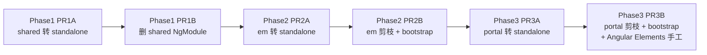

# Angular Standalone 迁移方案分析

**来源文档：**

- `docs/superpowers/specs/2026-05-27-standalone-migration-design.md` — 设计说明
- `docs/superpowers/plans/2026-05-27-standalone-migration.md` — 实施计划

---

## 做了什么？

这是一次把 `community/web` 里 **portal、em、shared** 三个 Angular 工程，从 **NgModule 架构** 迁到 **Standalone 组件架构** 的大型重构。**本身不升级 Angular 版本**（全程仍用 Angular 17.3），目的是为后续升到 **Angular 21** 铺路。

### 现状（迁移前）

| 项目 | Feature 模块数 | 路由模块 | 组件规模 | Standalone |
|------|----------------|----------|----------|------------|
| `shared` | 4 | 0 | 约几十个 | 0 |
| `em` | 72 | ~8 | ~300 | 0 |
| `portal` | 101 | ~10 | ~700 | 0 |

懒加载仍是旧写法：

```typescript
loadChildren: () => import('./foo.module').then(m => m.FooModule)
```

### 核心改动（三趟官方 schematic + 手工修补）

1. **`convert-to-standalone`**
   - 给所有 component/directive/pipe 加 `standalone: true`
   - 把原先 NgModule 的 `imports` 挪到各组件上
   - 测试里 `declarations` → `imports`

2. **`prune-ng-modules`**
   - 删掉不再需要的 NgModule
   - 把 `*-routing.module.ts` 换成 `*.routes.ts`
   - `loadChildren` 改为导入路由数组

3. **`standalone-bootstrap`**（仅应用，不含 `shared` 库）
   - `platformBrowserDynamic().bootstrapModule(AppModule)` → `bootstrapApplication(AppComponent, appConfig)`
   - 生成 `app.config.ts`，用 `provideRouter`、`provideHttpClient`、`provideAnimations` 等替代 `AppModule` 里的模块导入

### 分阶段交付（6 个 PR）



- **Phase 1 — `shared`**：4 个库模块（ai-assistant、ckeditor-wrapper、download、resize-event）→ 直接导出 standalone 组件。
- **Phase 2 — `em`**：72 个 feature 模块 + 路由模块 → `app.config.ts` + `bootstrapApplication`。
- **Phase 3 — `portal`**：最大（~700 组件）；额外**手工**改 `main-elements.ts`、`main-viewer-element.ts`（`DoBootstrap` + `createCustomElement` schematic 处理不了），用 `createApplication` + `embed-element.config.ts`。

### 计划文档还规定了

- 迁移前基线：`npm run build`、`npm run test`、`npm run test:em` 全绿。
- 每 PR 后：修 `NgbModalModule`、`CommonModule`、表单模块、Material 模块等「schematic 漏掉的全局依赖」。
- 成功标准：构建无 TS 错误、测试通过、`elements` / `viewer-element` 构建也通过。

> **说明**：计划里任务多为 `- [ ]` 未勾选，表示这是**待执行/进行中的工作清单**，不一定是已经全部合入 main 的「已完成记录」。

---

## 为什么要做？

根本原因是 **Angular 21 将不再支持用 NgModule 做 `loadChildren` 懒加载**。若继续堆在 NgModule 上，后续大版本升级会被卡住。

设计文档写得很直接：

> Angular 21 removes support for `loadChildren` with NgModules. This migration … unblocking the eventual Angular version upgrade.

因此这次迁移是 **「先改架构、后升版本」** 的策略：

- **现在**：在 Angular 17.3 上完成 Standalone + 路由数组 + `bootstrapApplication`，风险相对可控。
- **以后**：再单独做 Angular 17 → 21 的版本升级，不再背着整套 NgModule 包袱。

另外，官方提供了 `@angular/core:standalone` schematic，能用工具完成大部分机械改动，适合这种上千文件的改造。

---

## 有哪些好处？

### 1. 解除 Angular 21 升级阻塞（战略收益）

- 懒加载、启动方式都符合 Angular 新方向。
- 版本升级与架构迁移解耦，可以分 PR、分阶段验证，降低「一次升大版本 + 改架构」的爆炸半径。

### 2. 与 Angular 现代模型对齐

| 方面 | NgModule 时代 | Standalone 之后 |
|------|----------------|-----------------|
| 依赖 | 藏在 Module 里，组件「隐式」可用 | 组件 `imports` 显式声明，依赖更清晰 |
| 懒加载 | `import(...Module)` | `import(...routes)`，路由文件更轻 |
| 启动 | `AppModule` 聚合一切 | `app.config.ts` + `providers`，结构更扁平 |
| 测试 | `declarations` | `imports`，与运行时一致 |

### 3. 可维护性与树摇（Tree-shaking）

- 组件只 import 自己用到的模块（Material、Forms、ng-bootstrap 等），有利于打包体积和「这个组件到底依赖什么」的可读性。
- 删除大量 `*.module.ts`、`*-routing.module.ts`，减少间接层和重复样板。

### 4. 共享库更简单

`shared` 不再导出 `AiAssistantModule` 这类 NgModule，消费者直接 import standalone 组件/指令，跨项目引用更直观（计划里也要求在 PR 1B 修 em/portal 对 shared 模块的引用）。

### 5. 嵌入场景（Web Components）更现代

Portal 的 `inetsoft-chart`、`inetsoft-viewer` 从 `DoBootstrap` NgModule 改为 `createApplication` + `createCustomElement`，与主应用同一套 provider 配置思路（`embed-element.config.ts`），和主应用的 `app.config.ts` 模式一致。

### 6. 工程化收益（计划文档强调）

- **6 个小 PR、顺序固定**（shared → em → portal），每步 `build` + `test` 门禁，便于 review 和回滚。
- 已知坑（NgbModal、CommonModule、Elements 入口）在设计里预先列出，减少踩雷成本。

### 需要接受的代价（文档也诚实写了）

- 改动面大（尤其 portal ~700 组件），短期 PR 多、修 import/provider 的工作量大。
- 部分原本「全局在 AppModule 里 import 一次」的依赖，要散落到各组件 `imports`（例如打开 modal 的组件要自带 `NgbModalModule`）。
- **本次不升 Angular 版本**，也不把 `HTTP_INTERCEPTORS` 改成 functional interceptors——范围刻意收窄，只做架构迁移。

---

## 两份文档各自角色

| 文档 | 角色 |
|------|------|
| **design** | 背景、范围、三阶段 schematic、路由/bootstrap/Elements 目标形态、手工干预点、成功标准 |
| **plan** | 逐步命令、分支/PR 命名、错误分类与修复、要删/要建的文件清单、agent 可勾选执行的任务 |

---

## 总结

这是在 **不立刻升级 Angular** 的前提下，把 StyleBI 前端从 **NgModule + Module 懒加载 + `bootstrapModule`** 迁到 **Standalone + 路由数组 + `bootstrapApplication`**，为 **Angular 21** 做准备。

好处主要是：**解除升级阻塞、架构现代化、依赖显式化、分阶段可控交付**。

代价是：**一次大规模、细碎的 import/provider 修补工作**。
